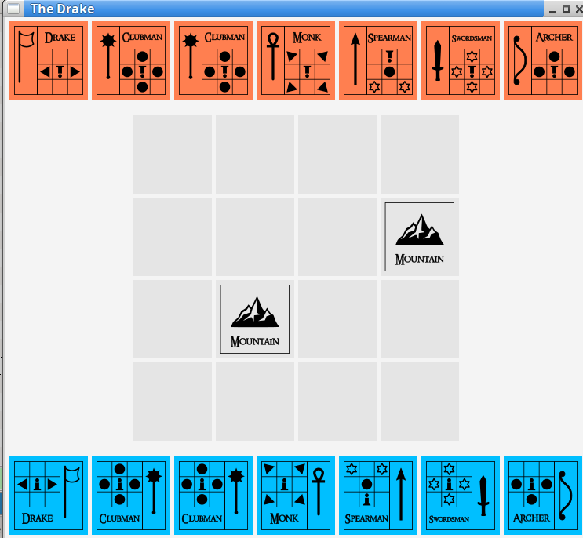

# FIT: Java The Drake

The Drake - pravidla hry The Drake je desková hra pro dva hráče inspirovaná úspěšnou hrou The Duke. V podstatě jde o zjednodušenou verzi The Duke, která se hraje na menším hracím plánu s menším počtem figur a některá její pravidla jsou přizpůsobena tomu, aby se hra dobře programovala.

Na tomto projekte som si vyskúšal OOP programovanie v Jave na jednoduchej deskovej hre. Precvičil som si základné OOP koncepty a zároveň som sa pohral aj s používateľským rozhraním pomocou knižnice JavaFX. Bol to zároveň môj prvý projekt, v ktorom som sa musel naučiť orientovať v codebase s viacerými triedami a rozhraniami.

